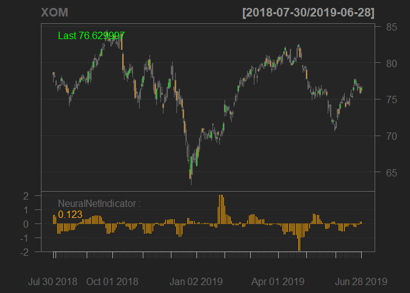
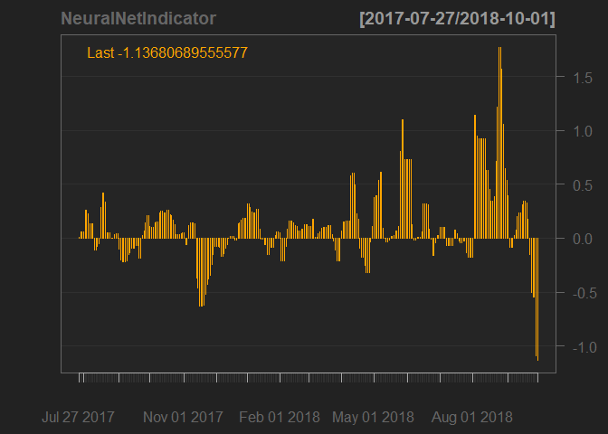

<!-- README.md is generated from README.Rmd. Please edit that file -->

# NeuralNetIndicator

<!-- badges: start -->

<!-- badges: end -->

The goal of NeuralNetIndicator is to provide functionality to calculate
a financial trading indicator based on artificial neural network price
predictions. The model bases price forecasts on reference stock prices
of the same sector. The focus is on the utilization of lag and time
delays in price movements of similar stocks in order to profitably
forecast price changes. With a lot of customizable parameters for the
network training algorithm, training windows sizes and a range of
Tukey’s smoothing functionalities, the indicator function offers a
useful tool to test various parameter settings for their profitability.
The information contained in the indicator values and usage suggestions
of the indicator functions can be found under the subheadings *Indicator
Values* and *Optimization and Backtesting* at the end of this document.
<br/><br/> Along the walk-forward trained model with various
training-algorithm adjustments and tweaking possibilities, this also
contains a function to download historical stock prices into a suitable
xts object as well as functionality to plot the oscillating indicator
along the underlying stock prices as a chart.

## Installation

In order to install NeuralNetIndicator from GitHub, you will first need
to install devtools.

``` r
# if not installed
install.packages("devtools")

devtools::install_github("n1tecki/NeuralNetIndicator")
```

## Example

This is an example which shows you how to access historical data and
train the forecast-model:

``` r
library(NeuralNetIndicator)
```

### getReferenceSymbols

First, the **getReferenceSymbols** downloads historical data into the
xts object *symbols*. Along the stock prices of interest, reference
assets (preferably from the same (GISC) sector) should be listed with
their stock symbols. In this case a time span of approximately 20 years
will be used.

``` r
## basic example code
symbols <- getReferenceSymbols(x = c('XOM','BP','COP','OXY','PXD','TOT','VLO'), start_date = '2000-10-10', 
                               end_date = '2020-10-10')
                               
head(symbols, 4)
#>            XOM.Close BP.Close COP.Close OXY.Close PXD.Close TOT.Close VLO.Close
#> 2000-10-10  12.95871 21.11406  5.070281  2.667497  13.19047  7.102553  1.131466
#> 2000-10-11  13.01947 21.45461  5.090010  2.659743  13.24884  7.102553  1.131466
#> 2000-10-12  13.07154 22.06273  5.242908  2.690761  13.54066  7.314998  1.154994
#> 2000-10-13  12.56812 21.23568  5.050553  2.566691  13.13211  6.999201  1.107939
```

### walkForwardNeuralnet

The xts object *symbols* of closing price of all stocks is used as the
input for the **walkForwardNeuralnet**. The traded asset at focus is
*XOM*, hence the first column is selected for the parameter *trad\_col*.
With a in-sample window of 700 days and out-of-sample of 60, the
parameter *slid* - number of days of how far into the future the
forecast should be calculated - is selected to be 4. The indicator
values in this example will not be smoothed, hence the smoothing
parameter is left as default NULL.  
The closing prices of *XOM*, price predictions and indicator value for
each day are exported into the xts object *indicator*.

``` r
indicator <- walkForwardNeuralnet(symbols, trad_col=1, neurons_int = c(3,5), 
                                  in_sample = 700, out_sample = 60, slid = 4)
                                  
head(indicator, 4)
#>            XOM.Close forecast indicator
#> 2003-07-29  21.22882 21.43451 0.9689374
#> 2003-07-30  21.16291 21.43184 0.9689374
#> 2003-07-31  21.31870 21.43704 0.9689374
#> 2003-08-01  21.16890 21.42723 0.9689374
```

### indicatorChart

The **indicatorChart** function allows to plot a chart of the indicator,
along the stock prices of interest (*symbol*) and *zoom* in on points of
interest. The indicator values *indicator$indicator* from the previously
received *indicator* object are passed on, along the stock code of the
corresponding stock prices.

``` r
indicatorChart(indicator$indicator, symbol = 'XOM', zoom = '2018-07-30::2019-07-01')
```



<br/><br/>
It is also possible just to plot the indicator itself to visualize the
values.

``` r
indicatorChart(indicator$indicator, zoom = '2017-07-27::2018-10-01')
```



## Indicator Values

The oscillating values of the indicator are the percentage difference
between the closing price of that day and the price forecast for *slid*
days ahead calculated by the neural network.  
For example, an indicator value of 1.4 means that the neural network
estimates a 1.4% increase in price in *slid* days. The same goes for
negative values - when the indicator shows a value of -2.3, the forecast
is that the price will fall 2.3%. <br/><br/> Based on those values buy
or sell positions can be generated. For example if the indicator reaches
a value of 2, a long position is entered; when the value is above 3, the
long position is increased.

## Optimization and Backtesting

As the **walkForwardNeuralnet** function has many parameters that can be
changed, it is encouraging the user to test different combinations of
parameter values (in-sample/out-of-sample length, number of nodes,
different combination of stocks, back-propagation algorithm of the
neural network, error threshold, …) for their profitability. One
recommendation is to use a genetic algorithm and back-testing the
different combinations of parameters for their profitability.
